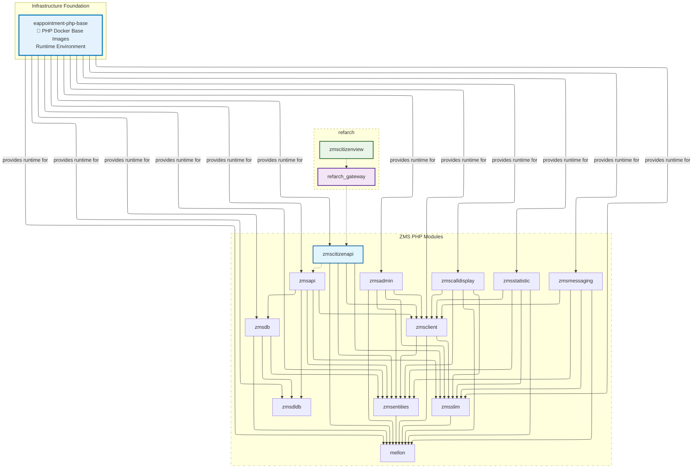

<!-- PROJECT SHIELDS -->
[![Contributors][contributors-shield]][contributors-url]
[![Forks][forks-shield]][forks-url]
[![Stargazers][stars-shield]][stars-url]
[![Issues][issues-shield]][issues-url]
[![MIT License][license-shield]][license-url]

# E-Appointment PHP Base
Infrastructure Foundation: eappointment-php-base provides standardized PHP runtime environments for eappointment [build](https://github.com/it-at-m/eappointment/blob/main/.github/workflows/php-build-images.yaml#L43) via the [Containerfile](https://github.com/it-at-m/eappointment/blob/main/.resources/Containerfile).

The current appointment system of the city of Munich will be replaced by Zeitmanagementsystem (ZMS) provided by the state of Berlin.

This repository has the definition for PHP base Docker images for runtime.

The original Repository can be found at https://gitlab.com/eappointment/php-base

For more details on the project, see https://github.com/it-at-m/eappointment

## License
This repository is licensed as MIT

Das derzeitige Terminsystem der Stadt München wird durch das vom Land Berlin bereitgestellte Zeitmanagementsystem (ZMS) ersetzt. 

Dieses Repository enthält die Definition für PHP-Basis-Docker-Images für Laufzeit.

Das Original-Repository finden Sie unter https://gitlab.com/eappointment/php-base

Weitere Einzelheiten über das Projekt finden Sie unter https://github.com/it-at-m/eappointment

## Lizenz
Dieses Repository ist lizenziert als MIT

## Branch Naming Convention
To keep our branch names organized and easily understandable, we follow a specific naming convention for all branches created in this repository. Please adhere to this convention when creating new branches:

1. **type**: The type of work the branch represents. This should be one of the following:
   - `feature`: For new features, PHP Upgrade or enhancements.
   - `bugfix`: For bug fixes.
   - `hotfix`: For urgent fixes that need to be applied quickly.
   - `cleanup`: For code refactoring, or documentation updates.
   - `docs`: For updating documentation such as the README.md CODE_OF_CONDUCT.md LICENSE.md CHANGELOG.md CONTRIBUTING.md. Providing a ticket number or project for docs is optional.
   - `chore`: For maintaining and updating dependencies, libraries, PHP/Node/Twig Versions, or other maintenance work.

2. **project**: The project identifier. This should be:
   - `zms` for the ZMS project.
   - `mpdzbs` for the MPDZBS project.

3. **issue number**: The ticket or issue number related to this branch (use digits only). This helps track the branch to a specific issue in the project management system.

4. **description**: A brief, lowercase description of the branch's purpose, using only lowercase letters, numbers, and hyphens (`-`).

- Always use lowercase letters and hyphens for the description.
- The issue number should be a numeric ID corresponding to the relevant ticket or task.
- Descriptions should be concise and informative, summarizing the branch's purpose.

#### Examples

- **Feature Branch**: `feature-zms-12345-add-base-image-for-php-8-2`
- **Bugfix Branch**: `bugfix-mpdzbs-67890-fix-crash-on-startup`
- **Hotfix Branch**: `hotfix-zms-98765-critical-fix-for-login`
- **Cleanup Branch**: `cleanup-mpdzbs-11111-remove-unused-code`
- **Chore Branch**: `chore-zms-2964-composer-update`
- **Docs Branch**: `docs-zms-0000-update-readme` `docs-zms-release-40-update-changelog`

(<a href="#top">back to top</a>)

<!-- MARKDOWN LINKS & IMAGES -->
<!-- https://www.markdownguide.org/basic-syntax/#reference-style-links -->
[contributors-shield]: https://img.shields.io/github/contributors/it-at-m/eappointment-php-base.svg?style=for-the-badge
[contributors-url]: https://github.com/it-at-m/eappointment-php-base/graphs/contributors
[forks-shield]: https://img.shields.io/github/forks/it-at-m/eappointment-php-base.svg?style=for-the-badge
[forks-url]: https://github.com/it-at-m/eappointment-php-base/network/members
[stars-shield]: https://img.shields.io/github/stars/it-at-m/eappointment-php-base.svg?style=for-the-badge
[stars-url]: https://github.com/it-at-m/eappointment-php-base/stargazers
[issues-shield]: https://img.shields.io/github/issues/it-at-m/eappointment-php-base.svg?style=for-the-badge
[issues-url]: https://github.com/it-at-m/eappointment-php-base/issues
[license-shield]: https://img.shields.io/github/license/it-at-m/eappointment-php-base.svg?style=for-the-badge
[license-url]: https://github.com/it-at-m/eappointment-php-base/blob/main/LICENSE
[product-screenshot]: images/screenshot.png
